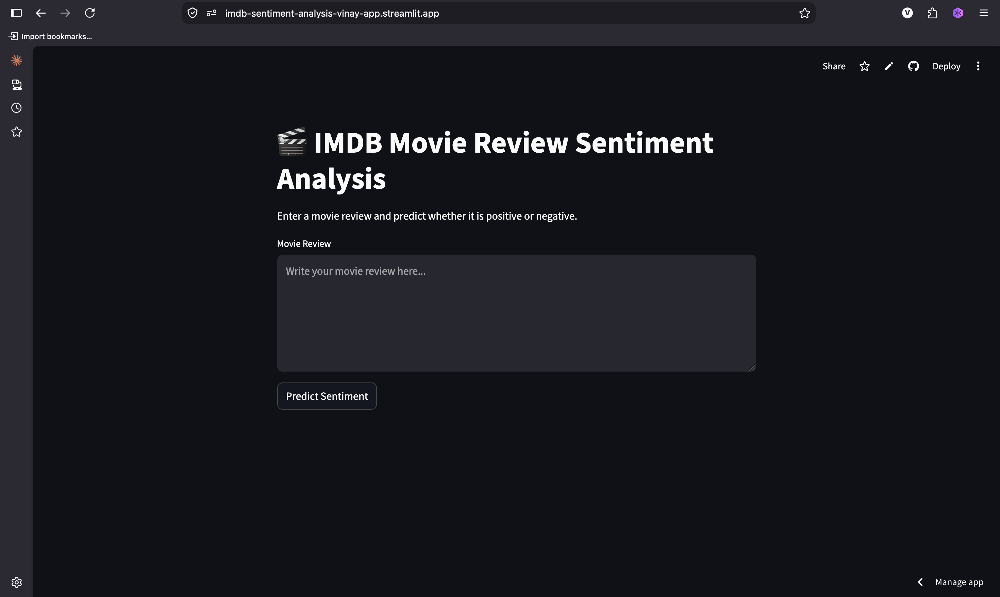
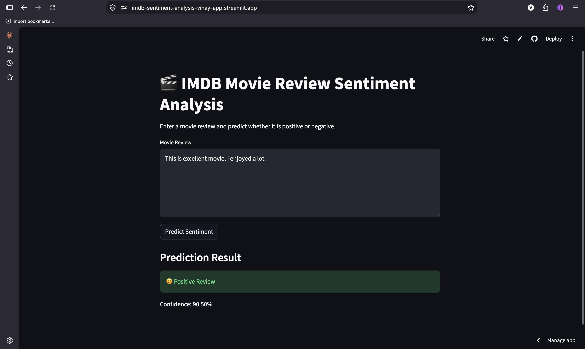
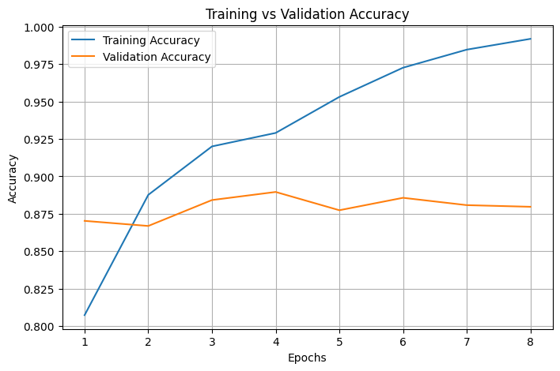
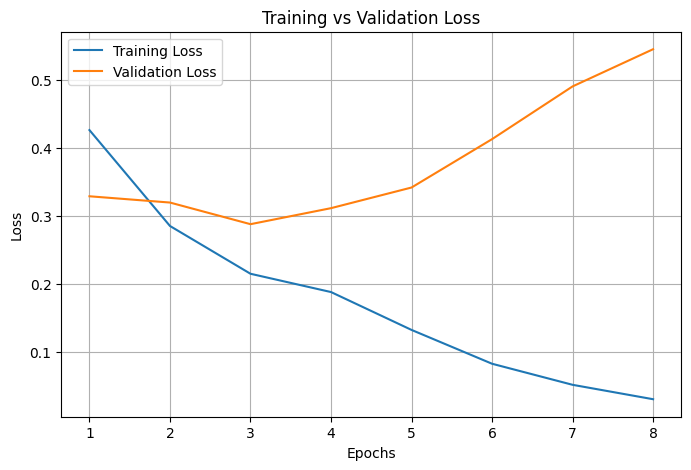
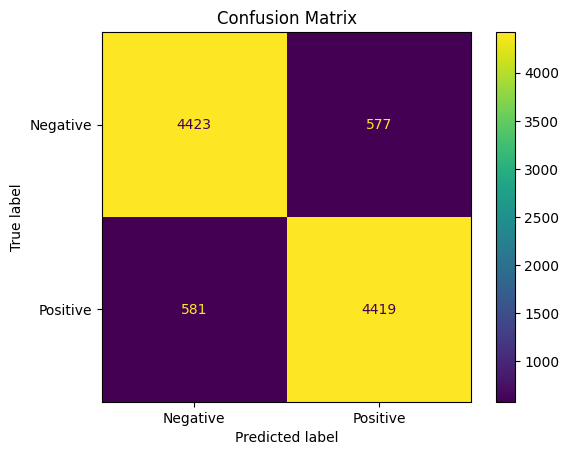
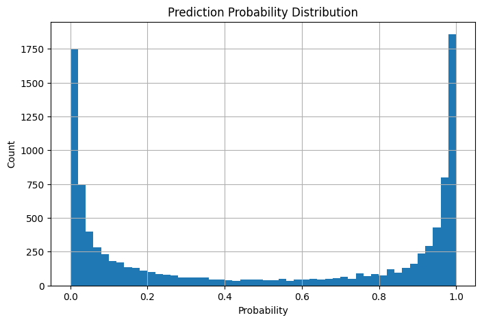

# 🎬 IMDB Sentiment Analysis using LSTM

A deep learning based NLP project that classifies IMDB movie reviews into **Positive** or **Negative** sentiment using an LSTM neural network.

[🚀 Live Demo](https://imdb-sentiment-analysis-vinay-app.streamlit.app/)

[💻 GitHub Repository:](https://github.com/vinay98485/imdb-sentiment-analysis)


## 📌 Project Overview

This project implements a complete end-to-end sentiment analysis pipeline:

- Text preprocessing
- Text cleaning
- Label encoding
- Tokenization
- Sequence conversion
- Padding
- Word embedding
- LSTM model training
- Model evaluation
- Sentiment prediction
- Streamlit deployment


## 🏗️ Project Workflow

```
IMDB Dataset
      ↓
Text Cleaning
      ↓
Tokenizer
      ↓
Text Sequences
      ↓
Padding
      ↓
Embedding Layer
      ↓
LSTM Network
      ↓
Dense Layer + Sigmoid
      ↓
Positive / Negative Prediction
```


## 🧠 Model Architecture

```
Embedding Layer
        ↓
LSTM (128 Units)
        ↓
Dropout (0.5)
        ↓
Dense Layer (Sigmoid)
```


## ⚙️ Model Configuration

| Parameter               | Value              |
|-------------------------|--------------------|
| Dataset                 | IMDB Movie Reviews |
| Vocabulary Size         | 10,000             |
| Maximum Sequence Length | 300                |
| Embedding Dimension     | 128                |
| LSTM Units              | 128                |
| Optimizer               | Adam               |
| Loss Function           | Binary Crossentropy|
| Output Activation       | Sigmoid            |


## 📂 Project Structure

```
imdb-sentiment-analysis/

├── data/
│   └── IMDB_Dataset.csv
│
├── models/
│   ├── best_model.keras
│   ├── tokenizer.pkl
│   └── history.pkl
│
├── screenshots/
│   ├── homepage.png
│   ├── prediction.png
│   ├── accuracy_curve.png
│   ├── loss_curve.png
│   ├── confusion_matrix.png
│   └── prediction_distribution.png
│
├── src/
│   ├── preprocess.py
│   ├── train.py
│   ├── evaluate_model.py
│   └── predict.py
│
├── streamlit_app.py
├── requirements.txt
└── README.md
```


# 📊 Model Evaluation

The model evaluation includes:

- Training and validation accuracy curves
- Training and validation loss curves
- Confusion matrix
- Classification report
- Prediction probability distribution


## Performance

Validation Accuracy:

```
~89%
```


The model uses:

- Early Stopping
- Model Checkpointing
- Reduce Learning Rate on Plateau

to improve training stability and reduce overfitting.


# 🖥️ Screenshots

## Homepage




## Prediction




## Accuracy Curve




## Loss Curve




## Confusion Matrix




## Prediction Distribution




# 🚀 Installation

Clone the repository:

```bash
git clone https://github.com/vinay98485/imdb-sentiment-analysis.git
```

Navigate to project:

```bash
cd imdb-sentiment-analysis
```

Create virtual environment:

```bash
python -m venv venv
```

Activate environment:

### macOS/Linux

```bash
source venv/bin/activate
```

### Windows

```bash
venv\Scripts\activate
```


Install dependencies:

```bash
pip install -r requirements.txt
```


# ▶️ Run Application

Start Streamlit application:

```bash
streamlit run streamlit_app.py
```


# 📝 Example Prediction

Input:

```
This movie was amazing. The acting was excellent and the story was very enjoyable.
```

Output:

```
Positive
```


# 🛠️ Technologies Used

- Python
- TensorFlow
- Keras
- LSTM
- Natural Language Processing
- Pandas
- NumPy
- Scikit-learn
- Matplotlib
- Streamlit


# 🔮 Future Improvements

- Implement Bidirectional LSTM
- Use pretrained word embeddings
- Compare with Transformer models
- Fine-tune BERT models


# 👨‍💻 Author

Vinay kumar

GitHub:
https://github.com/vinay98485